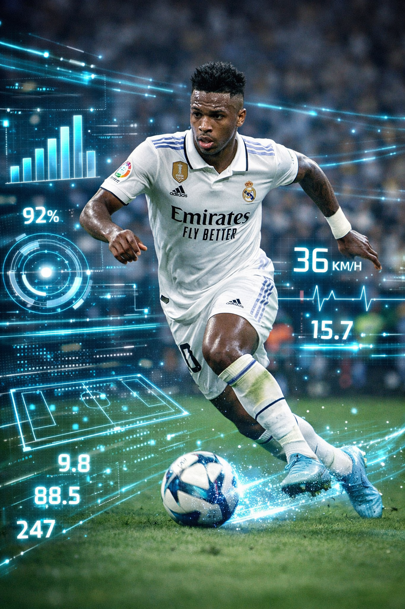

# Vini Jr. em Foco: Análise Tática e Estatística com IA ⚽📊

## 💻 Tecnologias Utilizadas
- **Gemini / ChatGPT** (IA Generativa de Texto): Usada para estruturar os dados e fazer a análise de desempenho do jogador.
- **Copilot Designer / Bing Image Creator** (IA Generativa de Imagem): Usada para criar uma arte visual do Vini Jr. mesclando futebol com dados holográficos.

## 🧠 Processo de Criação
1. **Modelagem de Dados**: Criei um prompt focado no perfil tático de Vinicius Junior para gerar estatísticas estimadas de performance da temporada 2025/2026.
2. **Análise de Desempenho**: Solicitei que a IA atuasse como um Scout/Analista esportivo para interpretar os números gerados (gols, assistências e dribles).
3. **Identidade Visual**: Desenvolvi um prompt visual no Copilot Designer para representar de forma gráfica e futurista a conexão do jogador com a análise de dados.

## 🚀 Resultados

### 📊 Estatísticas de Desempenho (Temporada 2025/2026)

| Métrica | LaLiga | Champions League | Total Consolidado | Média por Jogo |
| :--- | :---: | :---: | :---: | :---: |
| **Jogos Disputados** | 36 | 14 | 50 | — |
| **Gols Marcados** | 16 | 5 | 21 | 0,42 |
| **Assistências** | 5 | 7 | 12 | 0,24 |
| **Dribles Certos por Jogo** | 3,3 | 3,8 | — | 3,44 |
| **Passes Decisivos** | 51 | 28 | 79 | 1,58 |

### 🧠 Análise Tática
Os dados da temporada mostram que Vinicius Junior é um "gerador de caos controlado". Ele não se destaca apenas pela velocidade e pelo drible absurdo (mais de 3,4 por partida), mas sim pela sua alta taxa de passes decisivos (79 no total) e participação direta em gols (0,66 por jogo), tornando-se peça-chave do Real Madrid.

### 🎨 Arte Visual Gerada por IA

## 💭 Reflexão
Criar este projeto mostrou como as IAs Generativas facilitam a sintetização de dados e a criação de conceitos visuais de forma rápida, ajudando a criar apresentações esportivas mais ricas mesmo para quem está começando na área.nerative AI](https://github.com/digitalinnovationone/lab-natty-or-not/assets/730492/f4df26e8-f8f7-4419-8252-c69d73ea930c)
